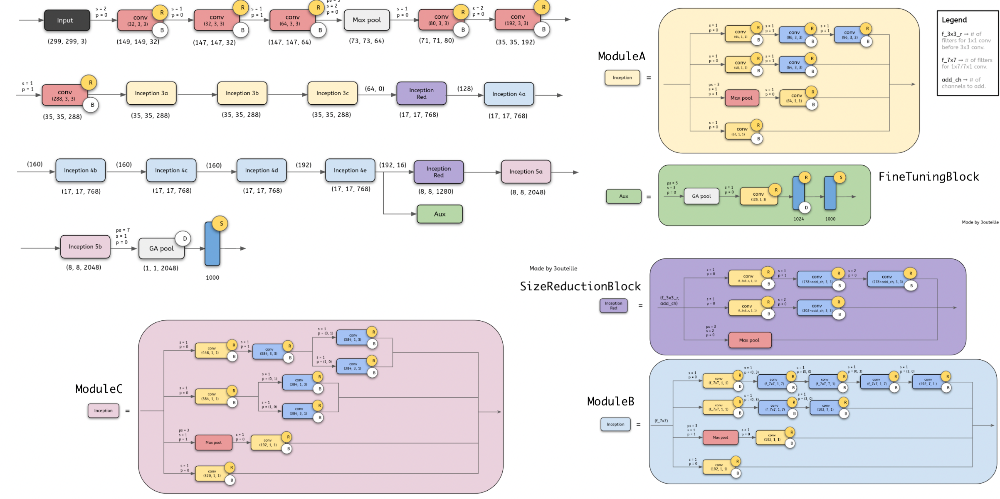
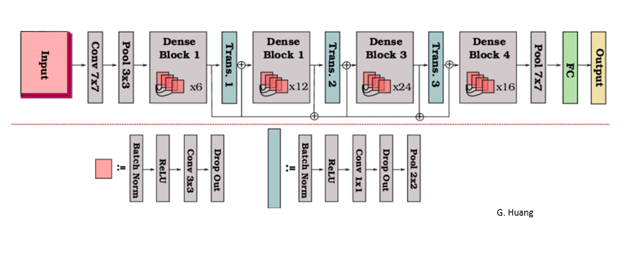

# Code that NeuralNet

An attempt to code different SOTA deep learning models using Tensorflow and PyTorch. All the model architure diagrams used in the Readme were considered for reference while coding the models. The tf and torch implementations of all the models are present in Tensorflow and Pytorch folders respectively. 

<p align="center">


</p>

General Dependencies for Running the code:

```md
python = 3.8
tensorflow = 2.6
pytorch = 1.8
numpy = 1.21
opencv = 4.5
scipy = 1.8
```

I suggest you to run the Pytorch and Tensorflow code in 2 different venv as running them together can cause some issues. To create a venv use 'conda'.

```sh
conda create -n tensorflow python=3.8
conda create -n pytorch python=3.8
```

### Training your own model (Tensorflow):

In order to train your own tensorflow model copy the dataset into the data folder. Put the training testing and validation images in ther respective folders. Then run the tensorflow_training.py file. Pytorch training loop can be found under the PyTorch directory but pytorch_training.py is work in progress.

```sh
python3 tensorflow_training.py -h

# Output:
# positional arguments:
#   model                 Name of the model. Must be one of: 
#                         1. AlexNet 
#                         2. DenseNet 
#                         3. InceptionV3 
#                         4. ResNet 
#                         5. VGG
#   shape                 Input Shape
#   classes               Number of classes

# optional arguments:
#   -h, --help  
#   -e, --epochs EPOCHS
#   -b, --batch_size BATCH_SIZE

python3 tensorflow_training.py <model_name> <1d-shape> <classes> 
```

This model will get saved in the Models directory from where you can load it and use for inference. Currently Checkpoint functionality is not available

### Inference (Tensorflow):

To perform predicions using models use the tensorflow_inference.py this file takes in 3 arguments the pretrained model path (keras model or .h5), classes and path to the image to be predicted. The prediction is unrefined and will return an array as the output. Size of array will = number of categories for which the model was trained.

```sh
python3 tensorflow_inference.py -h

# Output:
# positional arguments:
#   model_path  Path to pre-trained model
#   image       Path to image

# optional arguments:
#   -h, --help  show this help message and exit

python3 tensorflow_inference.py <model_path> <img_path>
```

## Image Classification

## Alexnet

Designed by Alex Krizhevsky in collaboration with Ilya Sutskever and Geoffrey Hinton (ImageNet Classification with Deep Convolutional Neural Networks)

AlexNet competed in the ImageNet Large Scale Visual Recognition Challenge on September 30, 2012. The network achieved a top-5 error of 15.3%, more than 10.8 percentage points lower than that of the runner up. The original paper's primary result was that the depth of the model was essential for its high performance, which was computationally expensive, but made feasible due to the utilization of graphics processing units (GPUs) during training.


[More about Alexnet](https://paperswithcode.com/paper/imagenet-classification-with-deep)

## VGG-19

Proposed by K. Simonyan and A. Zisserman in the paper “Very Deep Convolutional Networks for Large-Scale Image Recognition”

VGG is a classical convolutional neural network architecture. It was based on an analysis of how to increase the depth of such networks. The network utilises small 3 x 3 filters. Otherwise the network is characterized by its simplicity: the only other components being pooling layers and a fully connected layer. VGG-19 is a convolutional neural network that is 19 layers deep.


[More about VGG](https://paperswithcode.com/method/vgg)

## ResNet

Introduced by He et al. in Deep Residual Learning for Image Recognition

Residual Networks, or ResNets, learn residual functions with reference to the layer inputs, instead of learning unreferenced functions. Instead of hoping each few stacked layers directly fit a desired underlying mapping, residual nets let these layers fit a residual mapping. They stack residual blocks ontop of each other to form network: e.g. a ResNet-50 has fifty layers using these blocks.


[More about ResNet](https://paperswithcode.com/method/resnet)

## InceptionNetV3

Introduced by Szegedy et al. in Rethinking the Inception Architecture for Computer Vision

Inception-v3 is a convolutional neural network architecture from the Inception family that makes several improvements including using Label Smoothing, Factorized 7 x 7 convolutions, and the use of an auxiliary classifer to propagate label information lower down the network (along with the use of batch normalization for layers in the sidehead).



[More about InceptionV3](https://paperswithcode.com/method/inception-v3)

## DenseNet

Introduced by Huang et al. in Densely Connected Convolutional Networks

A DenseNet is a type of convolutional neural network that utilises dense connections between layers, through Dense Blocks, where we connect all layers (with matching feature-map sizes) directly with each other. To preserve the feed-forward nature, each layer obtains additional inputs from all preceding layers and passes on its own feature-maps to all subsequent layers.



[More about InceptionV3](https://paperswithcode.com/method/densenet)

## Upcoming Neural Networks

### Image Classification:

1. EfficientNet
2. Vision Transformer

### TODO:

- <input type="checkbox" disabled /> PyTorch Training
- <input type="checkbox" disabled /> PyTorch Inference
